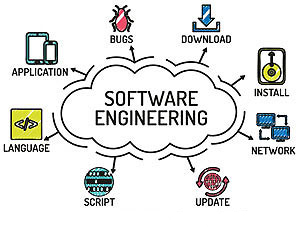

## Think before Asking
As I have spent most of my life in a learning environment, I had to ask many questions about things I didn't know. A lot of times, I would come up with a question off the top of my head, and since I had a teacher or friend physically there, it was never hard to ask. But, sometimes I wonder, will I look stupid asking this question? I always give the question I'm about to ask thought before actually saying it. Can I come up with the answer myself? Do they know the answer? Once I figured out that I do want to ask, a lot of times, it would come out wrong. I would forget to include a detail or word it in a weird way, that the person being asked would misinterpret it and either not know the answer, or guide me in the wrong way, of which I would have to correct them on what I've forgotten and apologize. I have gotten much better at asking questions now that I carefully think about the question I'm about to ask as well. Now that I'm learning software engineering, coupled with the online environment due to current world situations, its important to learn how smartly to ask questions in an online environment.  

## How to ask a Smart Question 
With programming, you have access to a enormous source of knowledge: the internet. You are able to search for things through a search engine, or a specialized forum and try and find for the answer you're looking for. However, maybe you can't find what you're looking for. In cases like this, a lot of times, its that you're not searching with the right keywords. Try and break down what exactly your problem is, and figure out which keywords are associated with your problem. If you're having troubles with a particular function, looking at the manual for with will help A LOT. Do not be like [this,](https://stackoverflow.com/questions/27507393/using-bitwise-and-operation-in-haskell/27507468#27507468), where a person asks why (.&.) 6 9 (or 6 bitwise AND 9) returned 0 and not 9. Had he looked at the manual, he could figure out that (.&.) performed AND bit by bit, which is why it gave 0. Remember this question, I'll refer back to it later. If you determine that you can't find the answer you're looking for, its time to prepare your question.

Remember your previous searches about your problem? You probably found topics relating to your problem, but isn't exactly your problem. Try and see the similarities your problem has with other problems, and what differences set them apart from the others. This will show that you put effort into solving your problem, which is appreciated. 
## Making Better Habits
One takeaway I would like to have from this course is object-orientated programming. Although I know the importance of such a concept, I've always strayed to creating all-in-one files, as most of the projects I've worked on was always small in scale, so I had no worries with fixing potential errors that could arise. Hopefully, I will be able to format my code more efficiently through this method, and reap the benefits of changing my workflow from working in a single file to having a organized system of files.
