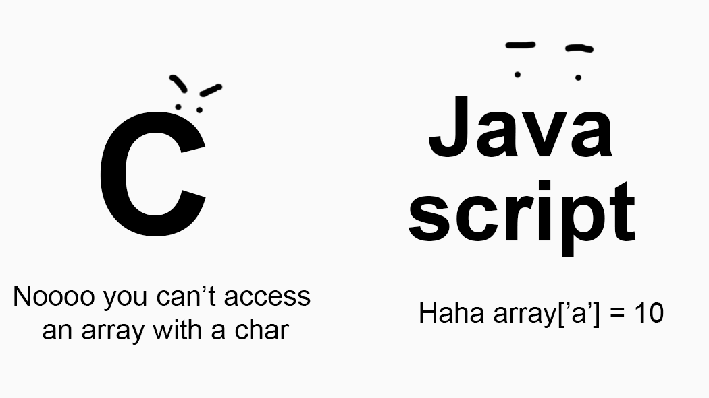

## First Impressions
When I started working with Javascript, the first thought I had about it was "Hey, this is pretty neat." It simplified the coding progress by a significant amount, by giving the user a lot of short hand notations for commonly used functions. One of the neat things I found about Javascript is that all types of variables: double, int, char, string, etc., are condensed into a single variable container called **var** (or **let**).  These containers interact seamlessly when passed to other functions, so you almost never have to worry about whether your function is defined to correctly take in a input. Although this is just a single thought, I'm sure as I dive deeper into Javascript, I'll find a lot of neat little features.

## Downfalls
In usage for software engineering, I think Javascript is an excellent coding language to start prototyping with. With a lot of short hand notations coupled with the ease of connecting together functions, you could create a working script in minutes. However, there is a gripe I have about Javascript. Every time I define a variable, I always worry if my function would be able to handle all data types that could possibly be its input. By allowing variables to be stored into a single container, there could have implications in certain situations. By having no restrictions on what types of variables are defined by **var**, an unwanted type could accidentally slip into a function, which could lead to consequences if the function doesn't know how to correctly handle the type of data given to it. Because of this, along with the fact that Javascript is likely doing a lot of processing of these implicit data types in the background, I think it wouldn't be a great coding language for final deployment of software that computes with large amounts of data.   

## Learning with WODs
When programming with Javascript, I feel I could effortlessly string together my thoughts on how I'm going to solve my problem into code. I no longer have to worry about which data types I should use, and making sure the parameters for my functions are defined correctly. All I need is a place holder for a variable and I'm good to move on to the next line, which is really neat. To get used to Javascript, I can take it on with athletic software engineering via WODs (Workout of the Day). Doing WODs using Javascript was pretty helpful for me to get used to the language, and lets me realize which parts could be condensed using a convention from Javascript. I think one of the best things from the WODs are the professor's solution. It introduces new ways of thinking that I wouldn't think of. For example, while I was doing a WOD, I noticed that the professor's solution was pretty clever, where you could use the character you're counting, say 'a', as a index to an array, setting the value as its count. I would never of thought of doing such a thing, since with C, the main language that I use, would be extremely bad practice.

## Takeaways
As I continue working with Javascript, I believe it will let me comine up with more creative solutions, as it gives me new ways of working with data that I never could with previously languages I've worked with. In time, I hope I'll be able to look past the first solution that pops into my head, but think how I would be able to manipulate the data with the new methods I've learned to come up with an clever solution.

