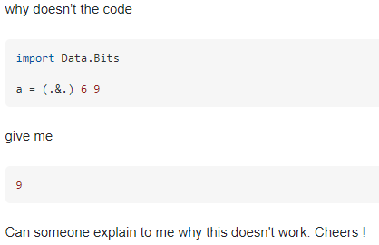

## Think before Asking
As I have spent most of my life in a learning environment, I had to ask many questions about things I didn't know. A lot of times, I would come up with a question off the top of my head, and since I had a teacher or friend physically there, it was never hard to ask. But, sometimes I wonder, will I look stupid asking this question? I always give the question I'm about to ask thought before actually saying it. Can I come up with the answer myself? Do they know the answer? Once I figured out that I do want to ask, a lot of times, it would come out wrong. I would forget to include a detail or word it in a weird way, that the person being asked would misinterpret it and either not know the answer, or guide me in the wrong way, of which I would have to correct them on what I've forgotten and apologize. I have gotten much better at asking questions now that I carefully think about the question I'm about to ask as well. Now that I'm learning software engineering, coupled with the online environment due to current world situations, its important to learn how smartly to ask questions in an online environment.  

## How to ask a Smart Question 
With programming, you have access to a enormous source of knowledge: the internet. You are able to search for things through a search engine, or a specialized forum and try and find for the answer you're looking for. However, maybe you can't find what you're looking for. In cases like this, a lot of times, its that you're not searching with the right keywords. Try and break down what exactly your problem is, and figure out which keywords are associated with your problem. If you're having troubles with a particular function, looking at the manual for with will help A LOT. Do not be like [this,](https://stackoverflow.com/questions/27507393/using-bitwise-and-operation-in-haskell/27507468#27507468) where a person asks why (.&.) 6 9 (or 6 bitwise AND 9) returned 0 and not 9. Had he looked at the manual, he could figure out that (.&.) performed AND bit by bit, which is why it gave 0. Remember this question, I'll refer back to it later. If you determine that you can't find the answer you're looking for, its time to prepare your question.

Remember your previous searches about your problem? You probably found topics relating to your problem, but isn't exactly your problem. Try and see the similarities your problem has with other problems, and what differences set them apart from the others. Gather this information and format it into your question. This will show that you put effort into solving your problem, and give some insight to what exactly your problem is, which is appreciated by those who want to attempt to answer your question. One important thing to do when creating your programming question is to include your code. This will help others figure out what approach you took and lets them determine if the problem lies in your code, or if it lies on something at a higher scale. Taking a look at the [6 bitwise 9 question](https://stackoverflow.com/questions/27507393/using-bitwise-and-operation-in-haskell/27507468#27507468) we seen earlier, the questioner gave no insight to what he thinks is suppose to happen of the (.&.) function, or how they came the conclusion that the resulting answer should be 9. To make this a better question, the questioner should state what he thinks the function is suppose to do, to show that they understand what should happen and that they've done some research. The questioner should also state how the answer to the operation should be 9, so others can see their thought process and help correct anything that they may have missed.

Once you've formulated your question, it might look something like [this.](https://stackoverflow.com/questions/11227809/why-is-processing-a-sorted-array-faster-than-processing-an-unsorted-array) In this question, the questioner runs a summing array program, measuring the time. A sorted array provides a significantly shorter time than a unsorted array, and the questioner is puzzled why. The questioner does a good job in stating why he thinks that the time should be similar, since they're are summing the same array size, the only difference being if it has been sorted or not. They included the code that they used in simulating the problem, and stated possible answers, such as a compiler anomaly, but ruled them out with further testing by using another compiler. By including this in their question, it show others that they have done research on the problem and attempted to determine what is the cause of this timing difference, which also helps others rule out what the problem could be. As a result of this, it allows the answerer to craft a well-defined answer, as they can focus on the specific question rather than covering all the possible answers, as well as matching his detailed question with a detailed answer.

## Remember to be Smart, not Stupid
If you're planning to ask a question, remember to be smart, not stupid about it. Some important things to remember from this are: 
- Do your research before asking!
- Include your code in your question
- State what you think should happen and the reasons why, and why you think its not happening
- Define possible solutions and why its not the case in your question

Asking smart questions will help others provide a helpful answer, so don't forget it!
