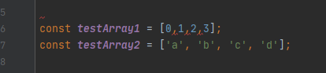

## What are UI Frameworks?
When creating a webpage, everything can be done in pure HTML, or the contents of the webpage, and CSS, or the style of the webpage. Although you can make anything you want, it is much easier said than done. You have all of your basic building blocks to build your website: divisions, margins, formatting, sizing, and positions to name a few. But, having to put it all together takes a consider amount of time, and making sure everything comes together neatly is very difficult. That is where UI Frameworks comes in, adding functionalities on top of these building blocks to help put together a nice website.

## But Should I Learn a UI Framework?
Since a UI Framework adds many functionalities on top of your regular HTML building blocks, this means one has a whole new set of functions to learn. You can see it as learning a new coding language. For example, in Semantic UI, these functionalities are added through tags when defining classes. You can string together these tags to define what you want, making it easy to be descriptive with what you want, instead of worrying about how to write each individual aspect of it. However, learning a UI Framework presents some drawbacks as well. Why give the time and effort to learn a UI Framework if you could already do it with HTML and CSS? 

I think that giving time and effort into learning a UI Framework well be worth while in the long run. The way that I see it, its a lot like building up your foundations instead of working with sticks and stones. Sure, you could get the job done with the most fundamental tools. However, that isn't time efficient at all. You're spending time building up each individual section from scratch, which adds up with all of the elements that comes in a webpage. Instead, you could make better tools, by learning a UI Framework, so building each of these sections takes little to no time at all. For example, if one wanted to make three separate columns of text with just HTML and CSS, you need to individually define each column's margins and padding, as well as position. Compare this to Semantic UI, you could just define a three column container, and place your columns of text inside here, which will be neatly spaced and formatted. What if you wanted to add another column? In raw HTML and CSS, you would need to shift and redefine everything to make room for the new column. In Semantic UI? Change the three to a four, and add your new column text. From what you can see, giving the time to learn how to use a UI Framework will make further endeavors a whole lot easier.

## Last Thoughts
UI Frameworks are definitely a helpful way to create a neat website. They allow the developer to easily piece together what they want without having to actually write the specifics on how to put it together. This allows for a much neater code development, making it much easier for debugging and changing if necessary. With this, I hope that every web developer can find a UI Framework that works seamlessly with what they want to do.
