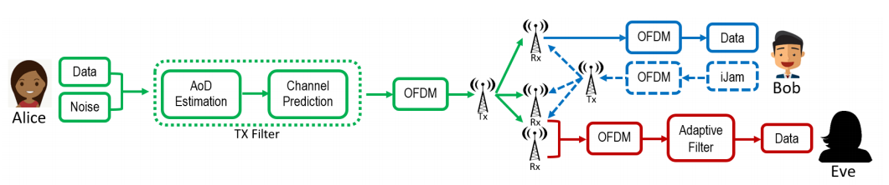

  

In a typical communication system, a sender, Alice, and a receiver, Bob, would send a data packet appended with pilot bits. Upon transmission, the packet undergoes a channel effect, changing the packet upon reception from Bob. Since the pilot bits are known to all parties, Bob can estimate the channel effect and undo the effect on the entire packet, to retrieve the original packet.

However, an eavesdropper, Eve, can eavesdrop the signal and recover the packet by also calculating the channel effect. To prevent this, Bob can be fitted with a second antenna. Now, when Alice sends a signal, it would send it twice. Bob will choose one of these signals to jam with its second antenna. This way, Bob will know which signal is correct, whereas Eve would have to guess which of the two is correct. Although a novel approach, it can be defeated if Eve has a multi-antenna setup, in short, can determine which of the two signal was jammed, and pick out the correct signal.

This is where we propose iJam with Channel Randomization, as Alice and Bob positions remains fairly static, we can predict the channel effect. We can precode the channel effect on Alice, and decode it on Bob, without the use of pilot bits. Without pilot bits, Eve would not know what the channel effect had on its perceived signal, along with the fact that the signal has been encoded with the channel effect from Alice-Bob, making it difficult for Eve to determine the original message.

We utilized LabView to perform these experiments, and fitted a Raspberry Pi with a rotating motor and antenna to collect experimental data.

You can read the full paper [here](https://arxiv.org/pdf/2007.03201v1.pdf).

