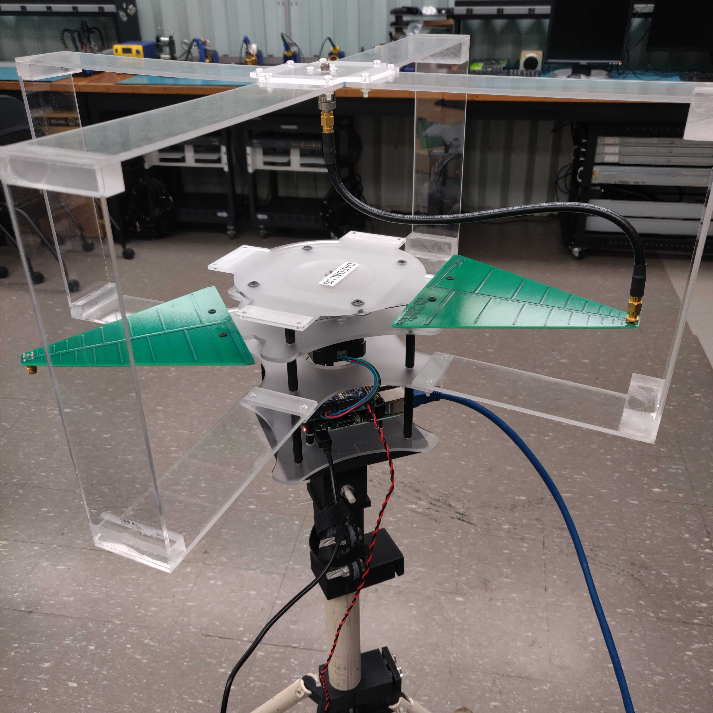

To conduct research projects at the Cybersecurity Research Lab, we needed a way to rotate a directional antenna. The materials we used is a Raspberry Pi 3 with a Adafruit Stepper Motor HAT, a CUI AMT22 rotary encoder, a QSH4218 stepper motor, and a 3-D printer to print out the frame.

We first connected the rotary encoder to the stepper motor, such that as the motor rotates, we are able to tell how much it rotated by. We connected the rotary encoder to the Raspberry Pi with its SPI interface. Once connected, we followed the datasheet supplied by the rotary encoder to learn how to request data. We used Python, and used the provided SPI interface to send a request command to the rotary encoder for its angular reading. We then created a functions to handle the requests of data to the encoder, and to convert the data into degrees.

Once we are able to correctly read the angular data, we can begin to rotate our motor. Using the Motor HAT, we connected it to the Raspberry Pi and the stepper motor. We tried serveral modes to rotate the stepper motor as provided by the Motor HAT's datasheet, and settled with microstepping for most granuality. Although the Motor HAT allows us to define the amount of "steps" to rotate the motor, these steps aren't reliably precise. We solved this problem by utilizing the readings from the rotary encoder to determine when to stop rotating, and to correct the positioning if necessary.

With all functionalities done, we can create a web interface for our rotator so we can control our new rotator from another computer. We utilized Flask to create a simple HTTP server, and hooked up all functionalities of our rotator to the webpage, so we can report the readings of our rotator live. With this, we can use it to communicate with LabView, a software which helps connect and run different pieces of lab equipment together. Since we can now communicate with the rotator through HTTP protocol, we can control our rotator through LabView's HTTP functions.

Source code (for the rotator) can be found as "rf_rotator" in my [Github.](https://github.com/ToomasYang/ToomasYang.github.io/tree/master/examples)

